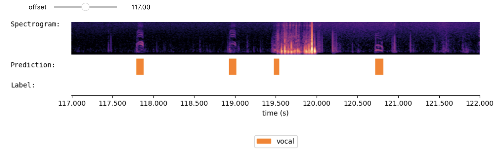

# Multi-channel WhisperSeg: 
Modifying WhisperSeg [https://github.com/nianlonggu/WhisperSeg](https://github.com/nianlonggu/WhisperSeg) for segmenting multi-channel audio data


## Install Environment

```bash
conda create -n mc-wseg python=3.10 -y
conda activate mc-wseg
pip install -r requirements.txt
conda install conda-forge::cudnn==8.9.7.29 -y
```
Install torch (suppose CUDA version is 12.1, for other version, please refer to https://pytorch.org/get-started/locally/):
```bash
pip install --upgrade torch torchvision torchaudio --index-url https://download.pytorch.org/whl/cu121
```

**NOTE for Windows OS:** For method 1 and 2, if running WhisperSeg on windows, one need to further uninstall 'bitsandbytes' by 
```bash
pip uninstall bitsandbytes
```
and then install 'bitsandbytes-windows==0.37.5'
```bash
pip install bitsandbytes-windows==0.37.5
```

Then open a new terminal, you can activate the 'mc-wseg' environment by 
```bash
conda activate mc-wseg
```

## Preprocess dataset
The training data folder is organized as below:
```
├── audio_count_0_channel_1.json
├── audio_count_0_channel_1.wav
├── audio_count_0_channel_2.wav
├── audio_count_0_channel_3.wav
├── audio_count_1_channel_1.json
├── audio_count_1_channel_1.wav
├── audio_count_1_channel_2.wav
├── audio_count_1_channel_3.wav
├── audio_count_2_channel_1.json
├── audio_count_2_channel_1.wav
├── audio_count_2_channel_2.wav
├── audio_count_2_channel_3.wav
├── audio_count_3_channel_1.json
├── audio_count_3_channel_1.wav
├── audio_count_3_channel_2.wav
└── audio_count_3_channel_3.wav
```
Three channels of audios are organized as:

AUDIO_FNAME_**channel_1**.wav <br>
AUDIO_FNAME_**channel_2**.wav <br>
AUDIO_FNAME_**channel_3**.wav <br>

The corresponding annotation JSON file is named as:

AUDIO_FNAME_**channel_1**.json 

**NOTE: The file AUDIO_FNAME_channel_1.json contains ONLY segments of audio channel 1. This is because multi-channel WhisperSeg is trained only to predict the first target channel!**

## Training 

```bash
python train.py --initial_model_path nccratliri/whisperseg-animal-vad --model_folder model/mc-whisperseg-zebra-finch --train_dataset_folder data/example_subset/8bird_data/train/
```

## Inference

```python
from audio_utils import SpecViewer
import librosa
import numpy as np
from glob import glob
import json
from model import MultiChannelWhisperSeg
```


```python
mc_segmenter = MultiChannelWhisperSeg( "model/mc-whisperseg-zebra-finch/final_checkpoint_ct2/", device="cuda" )
```

    Special tokens have been added in the vocabulary, make sure the associated word embeddings are fine-tuned or trained.


```python
sr = 16000
test_mc_audio, _ = librosa.load("data/example_subset/8bird_data/test/BP_2022-09-17_08-12-52_692166_0380000_allchannels_test.wav", sr = sr, mono = False)

radio_channels = test_mc_audio[:8]
mic_channels = test_mc_audio[8:9]  ## here we only use the 9th channel in the original 13-channel audio

predictions = mc_segmenter.segment( radio_channels, mic_channels, sr,
                      ## the following parameters are optimized for multi-channel zebra finch segmentation
                      min_frequency = 0,
                      spec_time_step = 0.0025,
                      min_segment_length = 0.005,
                      eps = 0.02,
                      num_trials = 1
                    )
```

    Segmenting radio channel 0 [■■■■■■■■■■■■■■■■■■■■■■■■■■■■■■■■■■■■■■■■■■■■■■■---] 95.00%
    Segmenting radio channel 1 [■■■■■■■■■■■■■■■■■■■■■■■■■■■■■■■■■■■■■■■■■■■■■■■---] 95.00%
    Segmenting radio channel 2 [■■■■■■■■■■■■■■■■■■■■■■■■■■■■■■■■■■■■■■■■■■■■■■■---] 95.00%
    Segmenting radio channel 3 [■■■■■■■■■■■■■■■■■■■■■■■■■■■■■■■■■■■■■■■■■■■■■■■---] 95.00%
    Segmenting radio channel 4 [■■■■■■■■■■■■■■■■■■■■■■■■■■■■■■■■■■■■■■■■■■■■■■■---] 95.00%
    Segmenting radio channel 5 [■■■■■■■■■■■■■■■■■■■■■■■■■■■■■■■■■■■■■■■■■■■■■■■---] 95.00%
    Segmenting radio channel 6 [■■■■■■■■■■■■■■■■■■■■■■■■■■■■■■■■■■■■■■■■■■■■■■■---] 95.00%
    Segmenting radio channel 7 [■■■■■■■■■■■■■■■■■■■■■■■■■■■■■■■■■■■■■■■■■■■■■■■---] 95.00%


## Visualize the segmentation results


```python
spec_viewer = SpecViewer()
```


```python
## check the segmentation results of the first radio channel
radio_channel_idx = 0
spec_viewer.visualize(
    test_mc_audio[radio_channel_idx:radio_channel_idx+1],
    sr = sr,
    prediction= predictions[radio_channel_idx],
)
```



